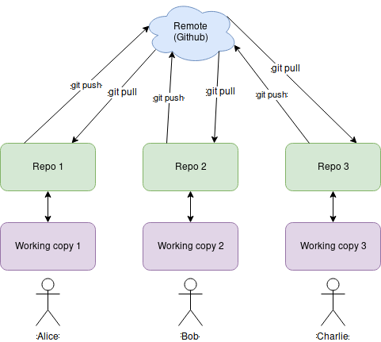

@title[Introduction]
## Applied Gitology
#### Git & GitHub pour les petits nouveaux

---
@title[Difference]
## Git ou GitHub ?
* Git -> Logiciel de gestion de versions (VCS), Linus Torvalds, 2006
* GitHub -> Site et service d'hebergement de repos Git, 2008

---
@title[Pourquoi ?]
## Pourquoi utiliser Git ?
* Historique des changements (VCS)
* Travail collaboratif
* Décentralisé (contrairement a SVN)

---
@title[Repositories]
## Repo ? Kezako ?
Un repository (dépot) contient tous les fichiers du projet + historique des changements (.git/).

`git init` pour créer un repo en local.

---
@title[Commit]
## Commit
Plus petite unité de changement. Créer un commit : `git commit`

---
@title[Workflow de base]
## Quelques premières commandes

Et une petite démo

---
@title[Status]
## Help ! Je suis perdu
Pas de panique -> `git status`

---
@title[.gitignore]
## Et si je veux garder des secrets ?
* `.gitignore` permet de lister les fichiers que vous ne voulez pas ajouter au repo (binaires générés par le compilateur, fichiers de config secrets, etc...)
* Wildcard `*` et `**` supportés, ainsi que noms de dossiers, par exemple `target/`
* En pratique, GitHub fournit des `.gitignore` pour la plupart des langages et scénarios possibles.

---
@title[Remotes]
## Remotes

Et une autre démo

---
@title[GitHub]
## Et GitHub dans tout ça ?
* GitHub permet d'héberger les remotes
* En pratique, initialiser le repo sur GitHub puis le cloner via Git : `git clone`

Note:
Initialiser un repo vide puis le cloner

---
@title[Branches]
## Branches

---
@title[Commandes de branches]
## Commandes de branches
* `git branch <nom>` pour créer une branche
* `git checkout <nom>` pour changer de branche
* `git merge <branche2>` pour merger branche2 dans la branche actuelle

---
@title[Merge Conflict]
## Merge conflict : aie aie aie
* Git gère le code ligne par ligne, donc si deux personnes modifient la meme ligne : conflit
* On résout alors le conflit "à la main"

---
@title[Open source et collaboration]
## Open source et collaboration
GitHub est "la plus grande communauté open source du monde" : Git et GitHub permet d'aisément collaborer aux projets FOSS d'autres utilisateurs

---
@title[Collaboration]
## Collaboration en pratique
* Ouvrir une issue sur un repo : signaler un bug ou demander une amélioration
* Forker un repo : créer une copie du repo d'un autre utilisateur (on appelle le repo forké 'upstream')
* Pull request : demander au propriétaire de 'upstream' d'intégrer les changements

Note:
Montrer un exemple d'issue (par exemple https://github.com/CodingTrain/website/issues). Aussi demo forking + PR.

---
@title[Dans un projet public...]
## Dans un projet public, ne pas oublier
* README.md : description du projet
* LICENSE : document légal. Sans licence, les lois de copyright normale s'appliquent (pas Free Software du tout). [Choose a Licence](https://choosealicense.com/)
* CONTRIBUTING.md et CODE\_OF\_CONDUCT.md : pour un gros projet, respectivement guide de contribution et code de conduite de la communauté

---
@title[GitKraken]
## Un GUI pour Git : GitKraken

---
@title[Student Developer Pack]
## Github Student Developer Pack
[https://education.github.com/pack](https://education.github.com/pack)
* Repos privés illimités
* GitKraken Pro pour un an
* Et pleins de bonnes choses !

---
@title[La suite]
## Et maintenant ?
* Des exercices : [https://github.com/SUStudentDevs/Applied-Gitology](https://github.com/SUStudentDevs/Applied-Gitology)
* Des guides plus détaillés : [https://guides.github.com](https://guides.github.com)
