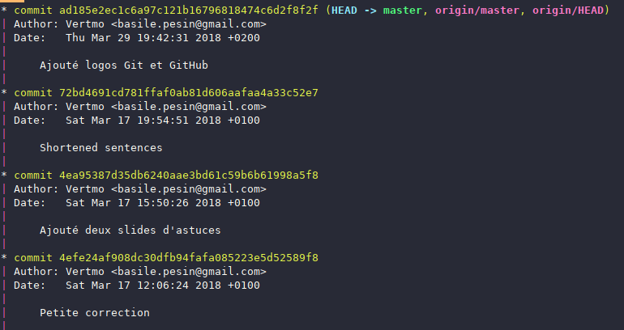
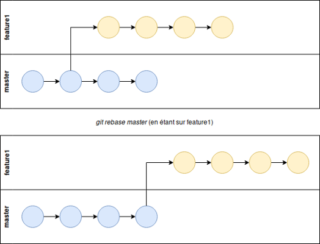
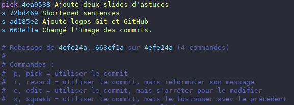
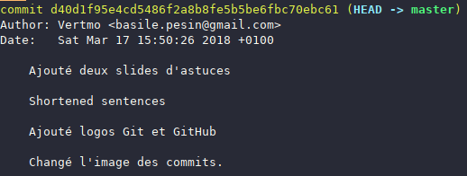
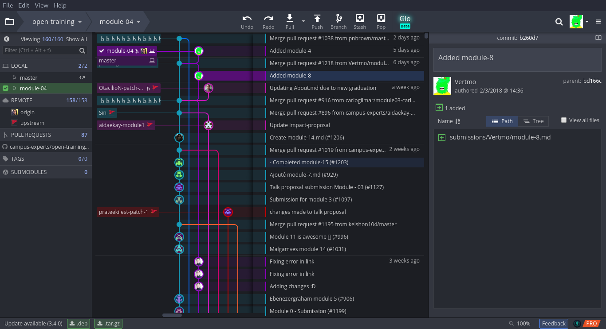

@title[Introduction]
## Applied Gitology
#### Git & GitHub pour les petits nouveaux

---
@title[Difference]
## Git ou GitHub ?

* Git -> Logiciel de gestion de versions (VCS), Linus Torvalds, 2005
* GitHub -> Site et service d'hebergement de repos Git, 2008

---
@title[Pourquoi ?]
## Pourquoi utiliser Git ?
* Historique des changements (VCS)
* Travail collaboratif
* Décentralisé (contrairement a SVN)

---
@title[Repositories]
## Repo ? Kezako ?
Repository (dépot) = fichiers + historique (.git/).

---
@title[Créer un repository]
## Créer un repository
* `git init` : créer un repo local
* `git clone <adresse>` : cloner un repo distant

---
@title[Commit]
## Commit
Plus petite unité de changement. `git commit`

---
@title[Workflow de base]
## Comment travailler

---
@title[Commandes]
## Quelques commandes
* `git add [fichiers]` : stager les fichiers
* `git commit -m "<message>"` : créer un commit avec `<message>`

Et une petite démo

---
@title[Status]
## Help ! Je suis perdu
Pas de panique -> `git status`

---
@title[.gitignore]
## Et si je veux garder des secrets ?
* `.gitignore` : fichiers que vous ne voulez pas ajouter au repo (binaires générés par le compilateur, fichiers de config secrets, etc...)
* Wildcard `*` et `**` supportés, ainsi que noms de dossiers, par exemple `target/`
* GitHub fournit des `.gitignore` pour la plupart des langages

---
@title[Remotes]
## Remotes

---
@title[Commandes de Remotes]
## Commandes de Remotes
* `git fetch --all` récupère toutes les informations sur les branches distantes
* `git pull <origin> <branch>` récupère et merge <branch> distante dans <branch> locale
* `git push <origin> <branch>` pousse <branch> locale vers <branch> distante

Et une autre démo

---
@title[Gérer les Remotes]
## Gérer les Remotes
* `git remote add <nom> <adresse>`
* `git remote remove <name>`
* `git remote -v`

---
@title[GitHub]
## Et GitHub dans tout ça ?
* GitHub permet d'héberger les remotes
* En pratique, initialiser le repo sur GitHub puis le cloner via Git : `git clone`

Note:
Initialiser un repo vide puis le cloner

---
@title[Branches]
## Branches

---
@title[Commandes de branches]
## Commandes de branches
* `git branch <nom>` pour créer une branche
* `git checkout <nom>` pour changer de branche
* `git merge <branche2>` pour merger branche2 dans la branche actuelle

---
@title[Merge Conflict]
## Merge conflict : aie aie aie
Git gère le code ligne par ligne, donc si deux personnes modifient la meme ligne : conflit

---
@title[Resolution]
## Resolution de conflit
On édite les fichiers incriminés "a la main"

Ou par fichier :
* `git checkout --ours <fichier>`
* `git checkout --theirs <fichier>`

---
@title[Open source et collaboration]
## Open source et collaboration
GitHub est "la plus grande communauté open source du monde" : Git et GitHub permet d'aisément collaborer aux projets FOSS d'autres utilisateurs

---
@title[Collaboration]
## Collaboration en pratique
* Issue : bug report ou demande d'amélioration
* Forker : copier le repo d'un autre utilisateur (on appelle le repo forké 'upstream')
* Pull request : demander au propriétaire de 'upstream' d'intégrer les changements

Note:
Montrer un exemple d'issue (par exemple https://github.com/CodingTrain/website/issues). Aussi demo forking + PR.

---
@title[Dans un projet public...]
## Dans un projet public, ne pas oublier
* README.md : description du projet
* LICENSE : document légal. Sans licence, les lois de copyright normales (pas Free Software du tout). [Choose a Licence](https://choosealicense.com/)
* CONTRIBUTING.md et CODE\_OF\_CONDUCT.md : pour un gros projet, respectivement guide de contribution et code de conduite de la communauté

---
@title[Stash]
## Astuce 1 : git stash
* `git stash push` sauvegarde de l'état de la copie de travail
* `git stash pop` charger le dernier état sauvegardé dans la copie de travail

---
@title[Rebase]
## Astuce 2 : git rebase

Changer l'historique. Un peu compliqué donc de la [doc](https://git-scm.com/book/en/v2/Git-Tools-Rewriting-History)

`git rebase` (`-i` pour la version "interactive")

---
@title[Rebase]
## "L'historique linéaire c'est mon objectif"

Ensuite, plus qu'a `git checkout master` et `git merge feature1`

---
@title[Rebase conflict]
## Il peut aussi y avoir des conflits pendant le rebase !
* `git rebase --abort` pour annuler
* Résoudre les conflits comme précédemment et `git rebase --continue`

---
@title[Squash]
## Squash : compresser les commits
`git rebase -i HEAD~4`

---
@title[Diff]
## Astuce 3 : git diff
Changements entre deux commits
* `git diff` : entre le dernier commit et la copie de travail
* `git diff <commit>` : entre `<commit>` et la copie de travail
* `git diff <commit1> <commit2>` : entre `<commit1>` et `<commit2>` (! ordre)

---
@title[Help]
## Si vous êtes perdus
* `git --help` : aide générale
* `git <cmd> --help` : aide d'une commande

---
@title[GitKraken]
## Un GUI pour Git : GitKraken

---
@title[Student Developer Pack]
## Github Student Developer Pack
[https://education.github.com/pack](https://education.github.com/pack)
* Repos privés illimités
* GitKraken Pro pour un an
* Et pleins de bonnes choses !

---
@title[La suite]
## Et maintenant ?
* Des exercices : [https://github.com/SUStudentDevs/Applied-Gitology](https://github.com/SUStudentDevs/Applied-Gitology)
* Des guides plus détaillés : [https://guides.github.com](https://guides.github.com)
